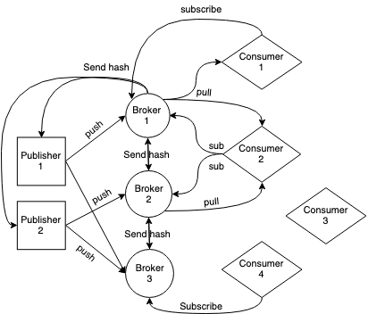

### A multi-threaded, distributed publish-subscribe system

#### Diagram

#### Running entities

This requires 3 processes, compile the project with IDEA and after opening 3 terminal 
sessions, fist run publishers, then brokers and finally consumers. The executable
class files are located at `out/production/distributed`. You will have to edit
the IP of the main class, also edit `data/brokers.txt` to match your local network **and** 
finally edit `helpers` package to use a proper absolute path.

##### Brokers
`java Main brokers -p 192.168.1.4:9090`

##### Publisher
`java Main publishers`

##### Consumer
`java Main consumers`

#### Notice
This project does not use neither Gradle nor Maven for dependency management and automation.
In order to compile, you will need several JAR files which can be found <a href="https://mega.nz/#!XPJgXQTQ!ZGCqxZ8U_FbQOMcYN_34E9Te8B_K9IRCs2eE0vC64qI">here<a>.
The lib folder must go to the project's root. Accessibility will improve in the future, keep calm. 
